# Team RAJ 🚀  
**SIG Algothon 2025 - Strategy, Research, and Insights**

> This repository contains our research notes, analysis plots, and algorithm submission(s) for the SIG Algothon.  
> It’s written as a post-mortem and as a reference for anyone learning systematic trading or competition-style quant research.

---

## Team

  

  <em> James Goss </em>

---

## Introduction

Hi, we’re Team RAJ. We’re engineering students at Monash, and we’re interested in quantative trading.

This repo is our write-up from **SIG Algothon 2025**. It includes:
- the key plots we used to understand the dataset,
- the strategy ideas we tested (and what we killed early),
- what we actually submitted,
- and what we learned from the process.

We tried to keep the focus on things that should hold up outside of one lucky backtest:
- being honest about what the data supports,
- keeping costs and constraints front-of-mind,
- and avoiding overfitting.

---

## Introduction to the Algothon

Here’s the setup the competition uses:

- **Universe:** 50 synthetic stocks (0–49), daily prices (~1500 days).
- **Info available:** on day *t* we only see prices up to day *t* (no future data).
- **Trading:** each day we output target share positions; the sim trades from yesterday’s position to the new one at the latest price.
- **Costs & limits:** 5 bps commission on dollars traded, and a ±$10,000 notional cap per stock (integer shares, clipped if exceeded).
- **Score:** rewards steady P&L, not just big swings:  
  **Score = mean(P&L) − 0.1 × std(P&L)**

---

# 1) Market Analysis

## 1.0 Strategy Feasibility Screening

Before developing specific trading strategies, I first assessed which approaches were compatible with the data resolution, execution model, and constraints of the competition. Several common strategy classes were evaluated and explicitly excluded or de-emphasized.

### Excluded: Market Making
Market making relies on intraday price dynamics, bid–ask spreads, and order book information.  
Given that the dataset consists solely of daily close prices with no microstructure data, market making strategies were deemed infeasible and excluded.

### Excluded: Pure Arbitrage
Classic arbitrage strategies require deterministic pricing relationships, cross-venue discrepancies, or known conversion mechanics.  
Due to the absence of intraday prices, cross-product constraints, or explicit pricing rules in the simulation, no persistent arbitrage opportunities were identified.

### De-emphasized: Machine Learning
Machine learning models were explored, but the relatively small sample size (~1500 daily observations) and low signal-to-noise ratio made reliable generalization difficult.  
In most cases, ML-based models failed to outperform simpler baselines after costs and constraints, and were therefore not used in the final strategy.

---

## 1.1 Pairs Trading — Viability Analysis

Pairs trading is a **relative-value** strategy. Instead of predicting whether the market will go up or down, it looks for two stocks that move closely together. If their prices temporarily diverge, the strategy bets that they will revert back to their usual relationship.

To assess whether this was viable, I first examined the cross-asset correlation structure.

  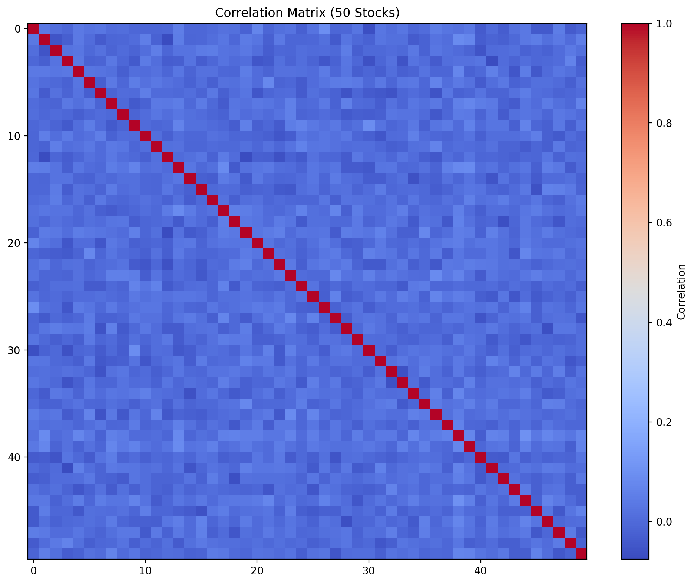

  <em>Figure 1. Correlation matrix of the 50 stocks. Off-diagonal values are uniformly low, indicating weak cross-asset relationships.</em>

### What This Graph Shows

The plot above is a **correlation matrix** of the 50 stocks.

- Each square represents the correlation between a pair of stocks.
- Red along the diagonal simply shows that each stock is perfectly correlated with itself (correlation = 1).
- The off-diagonal squares represent how strongly different stocks move together.
- Darker blue colours indicate low or near-zero correlation.

In this matrix, almost all off-diagonal values are light blue. The strongest pairwise correlation is only around **0.1**, which is very low.

### Why This Matters for Pairs Trading

Pairs trading relies on finding two assets that:

1. Move closely together (high correlation), and  
2. Have a stable long-term relationship (often tested with cointegration).

If two stocks barely move together in the first place, there is no meaningful spread relationship to exploit. Small, unstable correlations suggest:

- No strong common drivers between assets.
- No persistent relative pricing relationship.
- High likelihood that any apparent relationship is just noise.

Without strong and stable co-movement, any spread constructed between two stocks would behave more like random noise than a mean-reverting signal.

### Conclusion

Because the correlation structure showed **uniformly low cross-asset correlations**, there were no clear candidate pairs worth pursuing.

Given this, I decided not to proceed with deeper analysis such as formal cointegration testing. The data did not provide a strong enough foundation to justify further research into pairs trading, so this approach was excluded from the final algorithm.

---

## 1.2 Momentum

Momentum assumes that assets with strong recent performance continue to outperform over a given horizon (and weak performers continue to lag). In this market, the key question was whether returns showed enough short-term persistence to make momentum signals meaningful, rather than pure noise.

  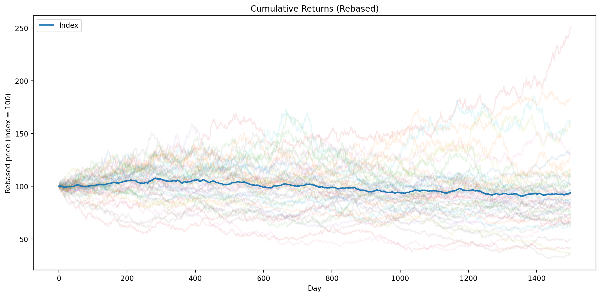

  <em>Figure 2. Cumulative returns of the 50 stocks (grey) with an equal-weight “market” index in red, rebased to 100. Individual names diverge substantially over time, while the index is smoother and often drifts sideways.</em>

### Cross-sectional behaviour

Figure 2 shows that while the equal-weight index does not exhibit a strong, sustained trend over the full period, individual stocks spread out widely. This indicates meaningful dispersion in performance across names and suggests the market experiences periods where moves are directional, even if the long-run index level is relatively flat.

To test whether directional moves tend to persist, I examined the autocorrelation of daily market returns.

  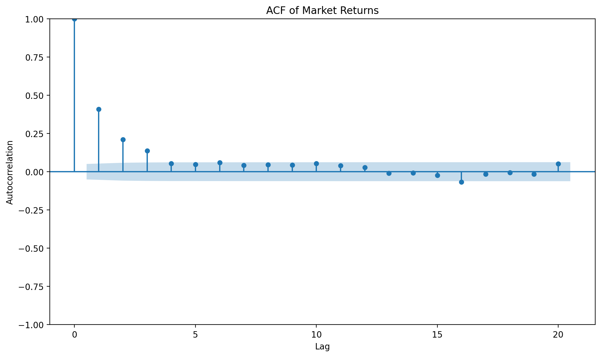

  <em>Figure 3. Autocorrelation function (ACF) of daily returns for the equal-weight market index. Lag 1 is strongly positive (around ~0.4) and exceeds the confidence band, indicating short-horizon return persistence.</em>

### Market-level momentum looks real

The market index shows clear positive autocorrelation at short lags (strongest at lag 1, still positive at lag 2). In practical terms, this implies that recent market direction carries information for the next one to two trading days, which is consistent with **short-horizon momentum**.

### But per-stock momentum is weak / inconsistent

Even when we explicitly look for the **stocks with the strongest rolling autocorrelation**, the effect is much smaller and far less stable than the market index.

  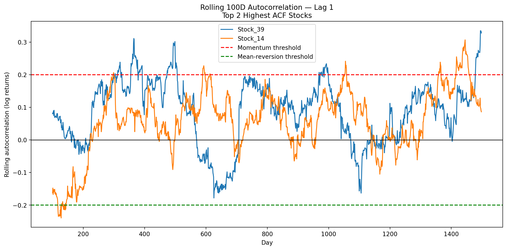

  <em>Figure 4. Rolling 100-day lag-1 autocorrelation for the top 2 highest-ACF stocks. These are the “best case” names for single-stock momentum.</em>

- The top two stocks’ rolling lag-1 ACF spends a lot of time near **0 to 0.15**, occasionally spiking above **0.2**, and sometimes turning negative.
- Compared with the market’s lag-1 ACF (≈ **0.4**), even the *best* single-name momentum is substantially weaker.

For contrast, the bottom-ACF stocks show that negative autocorrelation exists, but it also isn’t clean or persistent:

  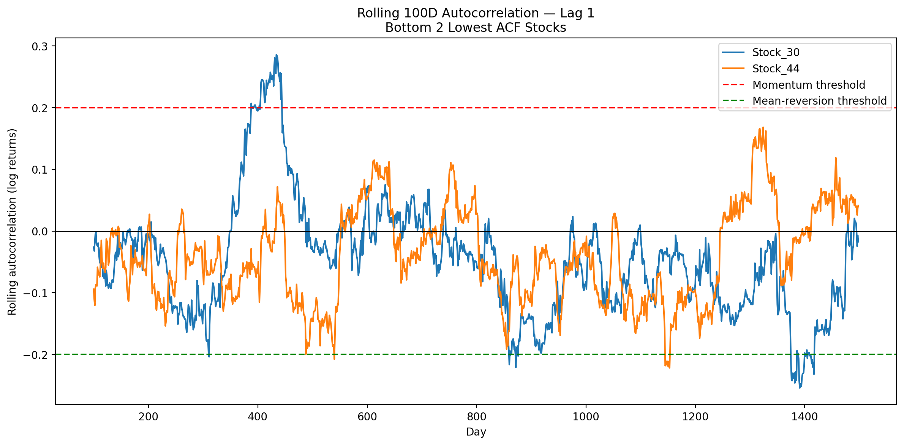

  <em>Figure 5. Rolling 100-day lag-1 autocorrelation for the bottom 2 lowest-ACF stocks. These names skew negative on average, but still exhibit unstable swings and occasional spikes.</em>

### Conclusion

- **Momentum exists primarily at a market-wide level.** The index shows strong short-lag persistence (lag-1 ACF ~0.4).
- **Momentum is not reliably tradable per-stock.** Even the top-ACF stocks have much weaker and less stable autocorrelation than the market proxy.
- Practically, this pushed momentum usage toward **market regime / exposure filters**, rather than a “rank stocks by momentum and buy winners” approach.

---

## 1.3 Mean Reversion

Mean reversion assumes that large moves tend to be followed by a pullback toward an anchor (a rolling mean, long-run average, or some notion of “fair value”). In this market, the key viability question was whether returns exhibit **negative** short-horizon dependence (bounce-back), either at the market level or consistently across individual names.

  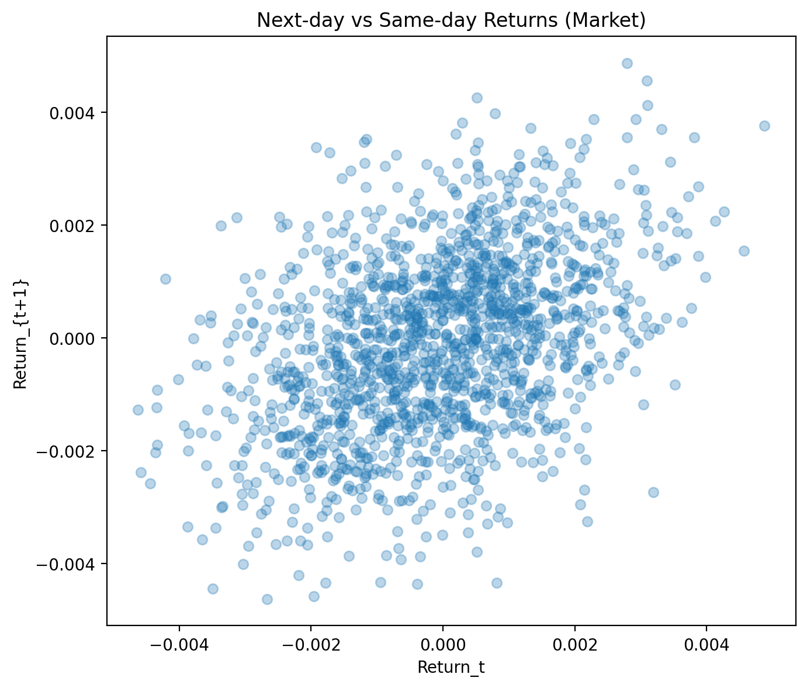

  <em>Figure 6. Next-day returns versus same-day returns for the equal-weight market. The fitted slope is positive (about 0.43), indicating continuation rather than reversal at a one-day horizon.</em>

### Market-level behaviour: continuation dominates

Figure 6 directly tests a simple mean-reversion premise: “after an up day, expect a down day” and vice versa. The relationship is clearly **positive**, not negative. This implies that, on average, daily market moves tend to **persist** into the next day rather than snap back. A naive mean reversion rule that fades yesterday’s move would therefore be fighting the dominant short-horizon structure in the data.

  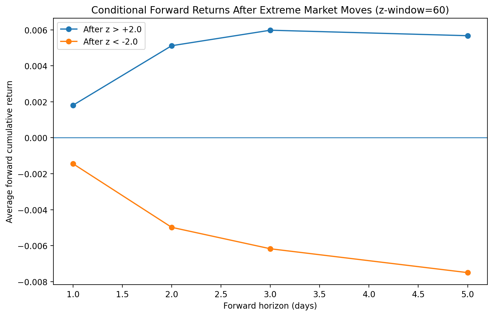

  <em>Figure 7. Average forward cumulative market returns after extreme days defined by a rolling z-score threshold (|z| &gt; 2). Post-extreme performance is directionally consistent with the initial move across multiple horizons.</em>

### Extremes do not reliably snap back

A common mean reversion variant is to fade “extreme” days, expecting them to be overreactions. Figure 7 tests exactly that by conditioning on large positive and negative shocks. The results show **directional follow-through** rather than clean reversals: after strongly positive days, average forward returns remain positive, and after strongly negative days, forward returns remain negative across 1 to 5 day horizons. This is the opposite of what a robust short-horizon mean reversion edge would require.

  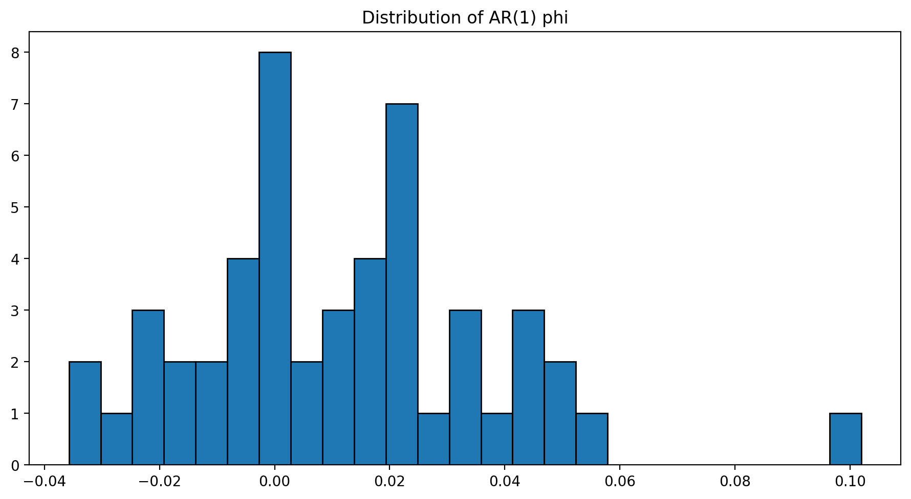

  <em>Figure 8. Distribution of AR(1) coefficients across individual stocks. Most names cluster near zero with a slight positive bias, and only a minority show negative coefficients consistent with short-horizon mean reversion.</em>

### Cross-sectional evidence: weak and inconsistent mean reversion

Figure 8 shows how much each stock’s return today depends on its return yesterday.

- If the AR(1) coefficient (φ) is **positive**, the stock tends to continue in the same direction (momentum).
- If φ is **negative**, the stock tends to reverse direction (mean reversion).
- If φ is **close to zero**, yesterday’s move has little to no predictive power.

In the graph, most stocks cluster near zero with a slight positive tilt. This means:

- There is no strong universal mean-reversion effect.
- A small amount of short-term continuation is present in some names.
- Any mean-reversion strategy would need to be selective rather than applied broadly.

### Conclusion

Across both the market proxy and the cross-section, the diagnostics do not support **simple daily mean reversion** as a primary edge. One-day dynamics show continuation, “extreme” moves tend to follow through, and single-name short-horizon mean reversion appears weak and inconsistent. Any mean reversion approach in this environment would need to be highly selective (instrument-level selection or specialised triggers) rather than applied as a universal fade rule.

---

## 1.4 Volatility & Regimes

This section looks at how the market’s volatility and short-term return behaviour change over time, and what that tells us about different regimes.

---

### 1.4.1 Overall level of volatility

First I looked at the distribution of rolling volatility across all stocks and days.

  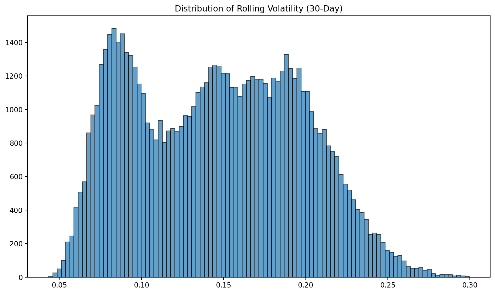

  <em>Figure 9. Histogram of 100-day annualised volatility for all stock–day pairs.</em>

**How to read it**

- Each bar counts how many observations had a given 100-day volatility level.
- Most observations sit between roughly **8% and 22%** annualised volatility.
- The shape is not a single sharp peak – there are several “humps”, which suggests the market moves through quieter and busier periods.

So the universe is not extremely wild, but volatility is clearly **not constant**.

---

### 1.4.2 Volatility across days and across stocks

Next I checked how volatility changes **over time** (market-wide) and **between stocks**.

  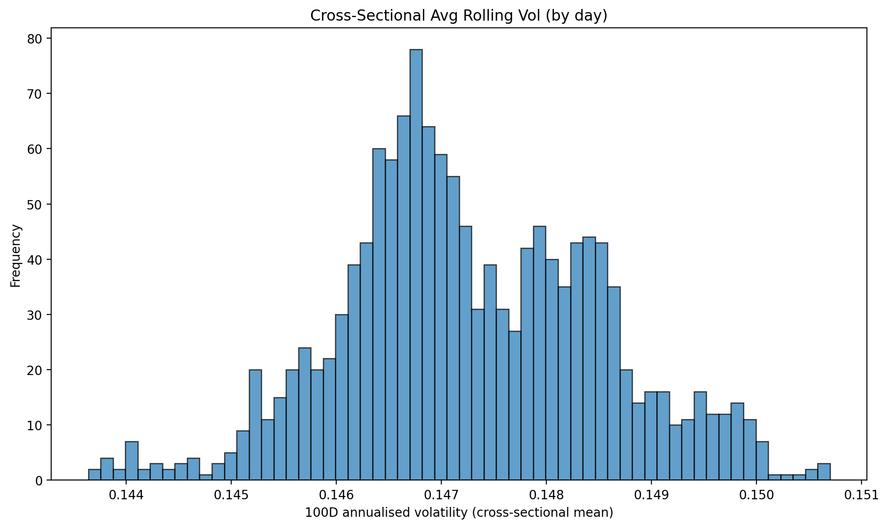

  <em>Figure 10. Distribution of cross-sectional average 100-day volatility (average across all stocks per day).</em>

  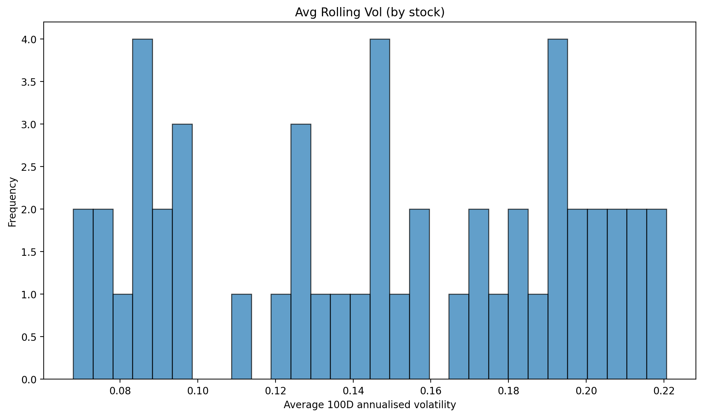

  <em>Figure 11. Distribution of average 100-day volatility by stock.</em>

**What they show**

- **By day (Figure 10)**: the cross-sectional average volatility moves around, but the spread is fairly tight. On most days, the “typical” stock is in a similar volatility band.
- **By stock (Figure 11)**: some names are much more volatile than others over the full sample. There is a clear range from steady stocks to very jumpy ones.

This tells us two things:

1. There is a **market-level volatility state** that slowly changes over time.
2. There is stable **cross-sectional dispersion**, with some stocks naturally riskier than others.

---

### 1.4.3 Volatility regimes over time

To see how volatility evolves, I looked at a **100-day rolling volatility** of the equal-weight index and marked simple low- and high-volatility bands.

  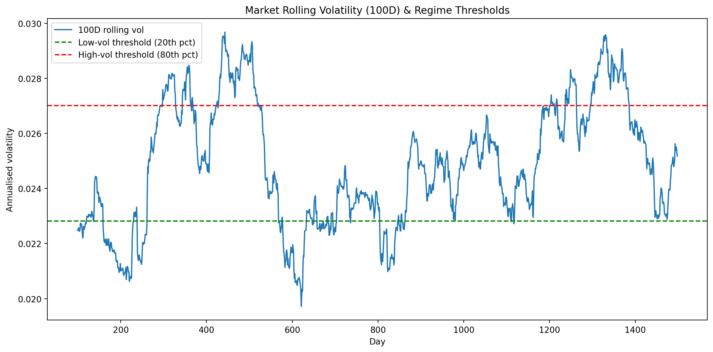

  <em>Figure 12. 100-day rolling volatility of the equal-weight index, with 20th and 80th percentile lines.</em>

**Reading the graph**

- The blue line is the 100-day rolling volatility.
- The green dashed line marks the **20th percentile** (low-vol threshold).
- The red dashed line marks the **80th percentile** (high-vol threshold).

When the blue line is near the green line, the market is in a **calmer regime**. When it is near or above the red line, the market is in a **high-vol regime**.

The plot shows that:

- Volatility clusters: once the market is calm or noisy, it tends to stay that way for a while.
- The range of volatility is not extreme, but the difference between low and high regimes is still meaningful.

---

### 1.4.4 Volatility is very much per-stock

A key practical finding was that volatility is not just a “market regime” variable — it is **highly cross-sectional**.

  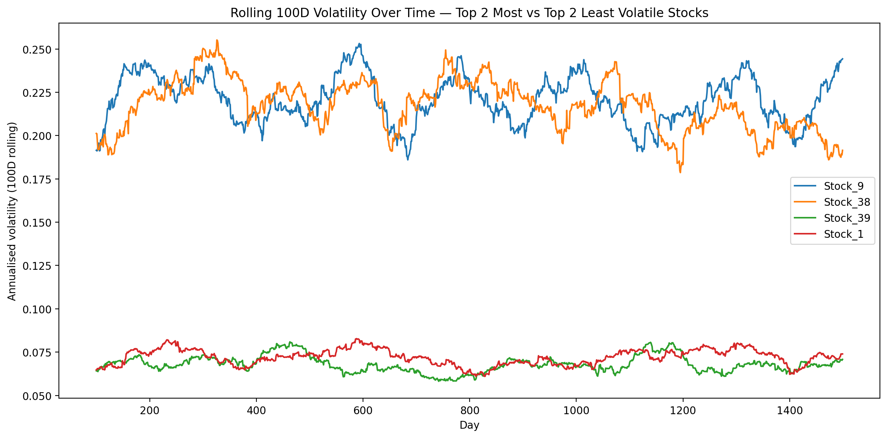

  <em>Figure 13. Rolling 100-day annualised volatility for the top 2 most volatile vs top 2 least volatile stocks.</em>

- The most volatile names sit around roughly **~0.19 to 0.25** annualised vol.
- The least volatile names sit around roughly **~0.06 to 0.08** annualised vol.
- Importantly, this gap is *persistent* — the “high vol” stocks remain high, and the “low vol” stocks remain low.

**Implication:** any strategy that sizes positions uniformly across names is implicitly taking much larger risk in the high-vol stocks. This strongly supports **volatility scaling / risk targeting per instrument** (and explains why naive equal-size signals often get dominated by a small subset of names).

---

### 1.4.5 Short-term autocorrelation: momentum vs mean reversion

Volatility alone does not tell us the direction of returns. To see whether short-term moves tend to **continue** (momentum) or **reverse** (mean reversion), I looked at **rolling autocorrelation** of the market index at different lags.

For each lag, I computed the autocorrelation over a rolling 100-day window:

- Values **above zero** mean that returns tend to have the **same sign** as in the past (momentum).
- Values **below zero** mean that returns tend to have the **opposite sign** (mean reversion).

The red line is a rough **momentum threshold**; the green line is a **mean-reversion threshold**.

#### Lag 1

  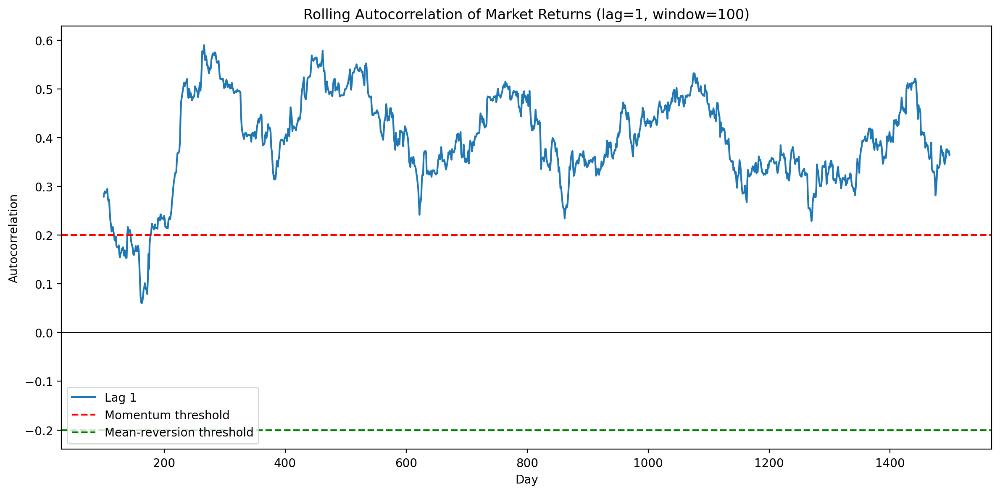

  <em>Figure 14. 100-day rolling lag-1 autocorrelation of index returns.</em>

- The blue line is **almost always positive**.
- For long stretches it stays above the red momentum threshold.
- It rarely comes close to the green mean-reversion line.

This means that, day-to-day, the index shows **strong short-term momentum**.

#### Lag 2

  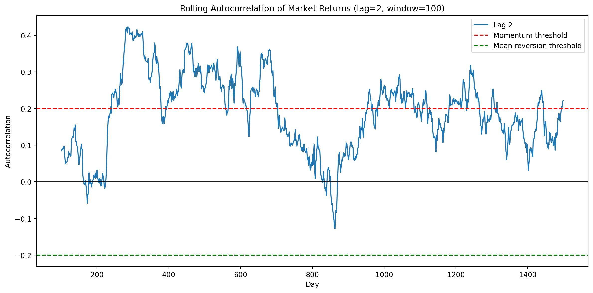

  <em>Figure 15. 100-day rolling lag-2 autocorrelation of index returns.</em>

- Lag-2 autocorrelation is also usually positive.
- It spends a fair amount of time at or above the momentum threshold, although values are smaller than for lag-1.

So momentum carries some information over **two days**, but weakens compared with lag-1.

#### Lag 5

  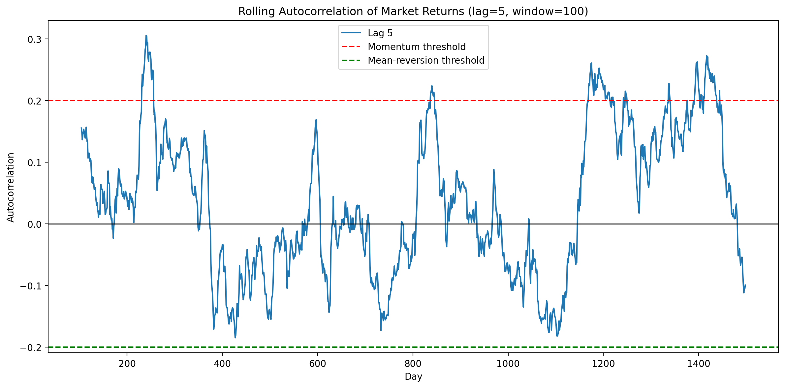

  <em>Figure 16. 100-day rolling lag-5 autocorrelation of index returns.</em>

- Around lag-5, the line is much closer to zero.
- It moves above and below zero and rarely touches the thresholds.

This suggests that by around **five days**, the clear memory in returns has faded. Momentum is weaker and less stable.

#### Lag 10

  

  <em>Figure 17. 100-day rolling lag-10 autocorrelation of index returns.</em>

- Lag-10 autocorrelation fluctuates around zero.
- It almost never reaches the momentum or mean-reversion thresholds.

This indicates **very little predictable structure** at this horizon – returns at a 10-day distance look close to independent.

---

### 1.4.6 Lead–Lag Structure (Market vs Stocks)

A natural follow-up question is whether the “market” moves first and individual stocks respond later (or vice versa). To test this, I computed cross-correlations between the equal-weight market return at time *t* and each stock return at time *(t + lag)*.

- **Positive lag** = the market leads the stock  
- **Negative lag** = the stock leads the market

  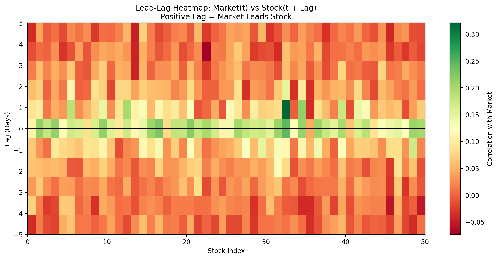

  <em>Figure 12. Lead–lag heatmap: correlation between Market(t) and Stock(t + lag). The strongest structure is concentrated at lag 0.</em>

Two clear patterns show up:

1. **Contemporaneous correlation dominates (lag 0).**  
   There is a strong band at lag 0 across almost all stocks, meaning most names simply co-move with the market on the same day.

2. **Any predictive lead–lag signal is weak and inconsistent.**  
   There are occasional pockets where lag +1 looks stronger for specific stocks, but this is not uniform across the universe and is likely fragile.

Averaging across all stocks makes the picture even clearer:

  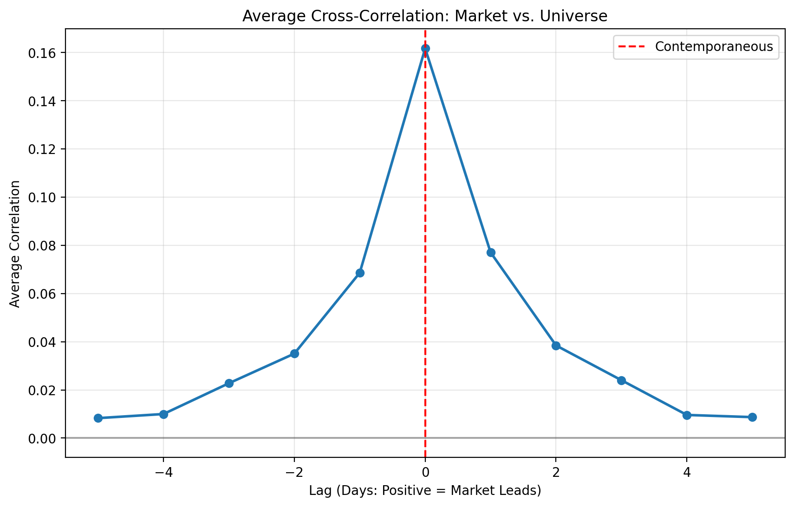

  <em>Figure 13. Average lead–lag profile (Market vs Universe). The peak is at lag 0; correlations decay quickly as |lag| increases.</em>

- The average correlation peaks at **lag 0 (~0.16)**.
- There is a smaller bump at **lag +1 (~0.08)** (market leading by 1 day), but it is much weaker than contemporaneous co-movement.
- Correlation decays quickly beyond 1–2 days in either direction.

**Conclusion:** lead–lag effects are not a strong, broad edge in this universe. The market and stocks mostly move together contemporaneously, which is more useful for risk/exposure control than for clean prediction.

---

### 1.4.7 Conclusions on volatility and regimes

Putting all of this together:

1. **Momentum is mostly market-wide, not per-stock.**  
   The market index has strong lag-1 autocorrelation (≈0.4), but even the top 2 per-stock ACF names have meaningfully lower and unstable autocorrelation. This implies momentum is more suitable as a **market exposure / regime filter** than as a single-stock selection signal.

2. **Volatility is very much per-stock.**  
   Some stocks are persistently ~3–4× more volatile than others (Figure 13). Risk is dominated by which names you trade and how you size them, so per-stock volatility scaling is essential.

3. **Volatility varies over time as well.**  
   The index 100-day volatility moves between low and high bands, forming clear volatility regimes. Volatility also clusters: calm periods and noisy periods tend to come in blocks rather than switching every few days.

4. **Short-term momentum is strongest at very short lags.**  
   The rolling autocorrelation plots show clear positive dependence at 1–2 day lags. By 5–10 days, the signal is much weaker and often indistinguishable from noise.

5. **Mean reversion is not a dominant feature at daily horizons.**  
   Autocorrelation is rarely strongly negative at the market level, and per-stock mean reversion is inconsistent. There are no long periods where the market consistently shows strong bounce-back behaviour.

6. **Lead–lag is mostly contemporaneous.**  
   The heatmap and average profile show the strongest relationship at lag 0, with only modest lag ±1 effects. This is more useful for understanding market coupling than building robust predictive signals.

These observations suggest that any strategy in this universe should:

- be aware that **risk changes over time**,  
- respect the fact that **short-term market momentum exists but fades quickly**,  
- size carefully because **volatility is highly stock-specific**, and  
- be cautious about relying on **daily mean reversion** or **lead–lag prediction**, which are weak and inconsistent in the data.

---

# 2) Algorithm Analysis

This section explains what we submitted, how we tested it, how we picked parameters, and what the results looked like. The main theme is that we tried to keep things **simple, testable, and hard to overfit**.

---

## 2.1 Final Strategy Overview

The final submission is a **market (index) momentum strategy** with **volatility-scaled sizing**.

- Build an **equal-weight “market index”** from the 50 instruments.
- Measure whether the index has been moving up or down over a short window (the **lookback**).
- If that move is big enough (passes a **threshold**) I take exposure:
  - index clearly up → go **long**
  - index clearly down → go **short**
  - small / noisy move → stay **flat**
- Size each instrument using **realised volatility**, so risk isn’t dominated by a few “wild” stocks.
- Enforce competition constraints:
  - **±$10,000** per instrument cap
  - **integer shares**
  - positions are clipped if needed

Why this made sense for this dataset:

- The strongest persistence we found was **market-wide**, not per-stock.
- The threshold reduces pointless trading (and commission drag).
- Volatility scaling avoids one or two high-vol names dominating P&L.

---

## 2.2 Trading Analysis (Example Trace: Stock 38)

The plot below shows one stock (Stock 38) over time:

1) price + trade markers  
2) equity curve (gross vs net)  
3) position held (shares)

  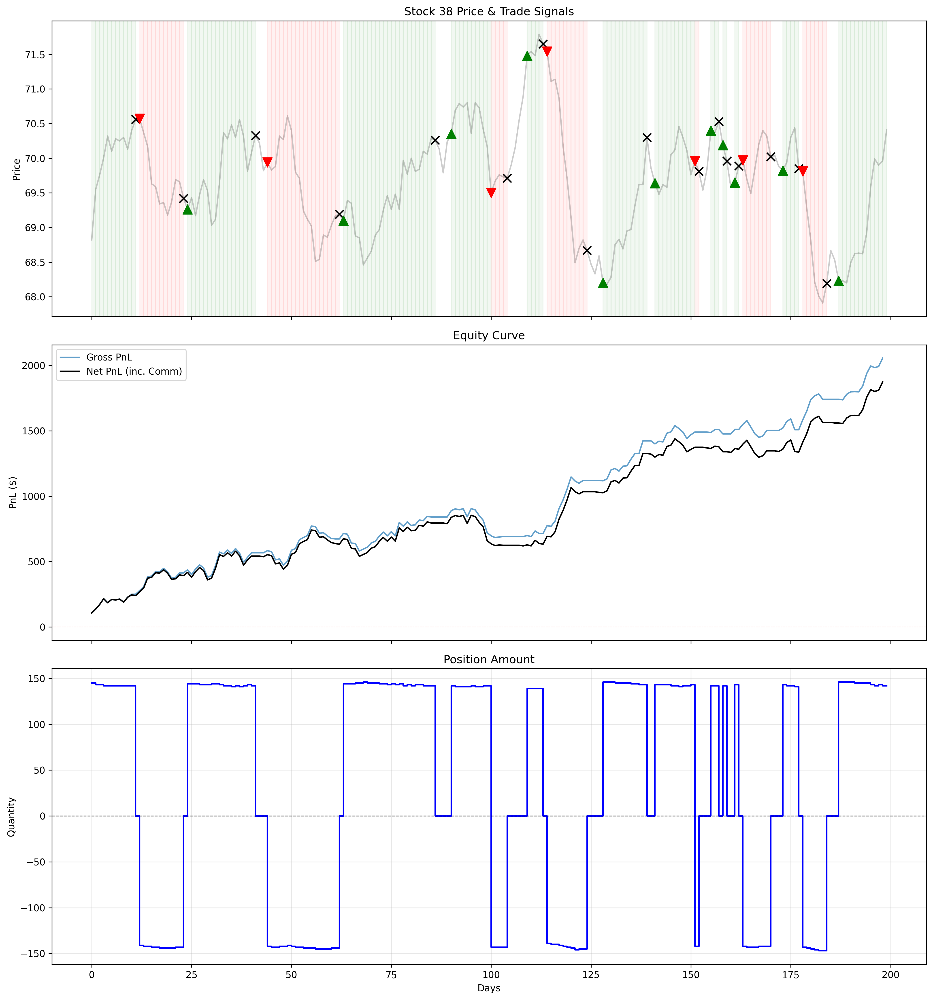

  <em>Figure 14. Stock 38 price + trade signals, equity curve, and position trace.</em>

How to read it:

- **Green ▲** = enter / flip into **long**
- **Red ▼** = enter / flip into **short**
- **Black ✕** = exit (go flat) or transition

What we like about this trace:

- Positions are held in **blocks** (multi-day holds), not constant flipping.
- Gross vs net P&L shows the cost of turnover, but net still rises when the regime is clean.
- The “messy” periods are obvious: when signals get choppy, entries/exits cluster and costs increase.

This is basically what the whole strategy is trying to do:
- take a market direction view,
- size sensibly,
- and avoid trading when the market move is too small to justify the fees.
---

## 2.3 Backtesting Methodology

We started with the standard evaluator most teams used (`eval.py` style). We didn’t rewrite the evaluator, we extended the same logic to run **walk-forward testing** and basic robustness checks.

### 2.3.1 The original `eval.py` (single run)

The baseline script:
- loads prices,
- steps forward day-by-day,
- calls `getMyPosition(history)` with no lookahead,
- clips positions to the ±$10k limit,
- charges 5 bps commission on traded dollar volume,
- records daily P&L and produces summary plots.

It can score the **last N days** or the **full dataset**, depending on `test_days`.  
The limitation is that it’s still **one window** (one slice of time).

### 2.3.2 What we added: walk-forward testing

Walk-forward testing repeats the evaluation across many consecutive time blocks:
- warm-up period,
- score a block,
- roll forward,
- score the next block,
- repeat.

This makes it much harder to fool ourselves with one lucky period.

### 2.3.3 Quick robustness checks

We also added a couple of cheap stress tests:
- **Noise test:** small random noise added to returns (checks fragility).
- **Shuffle/shift test:** break time alignment to ensure performance drops when structure is removed.

---

## 2.4 Parameter Selection & Robustness

The final bot is simple (index momentum + vol scaling), so almost all of the real tuning burden sits in two knobs:

1. **Momentum lookback** (how many days define the index trend)
2. **Momentum threshold** (how large the trend must be before taking risk)

### 2.4.1 Grid search on the last 1000 days

We ran a small grid search over:

- lookback windows (2 to 15 days)
- thresholds (0 to 0.004)

and scored each configuration on the **same objective metric** (mean P&L − 0.1×std P&L).

  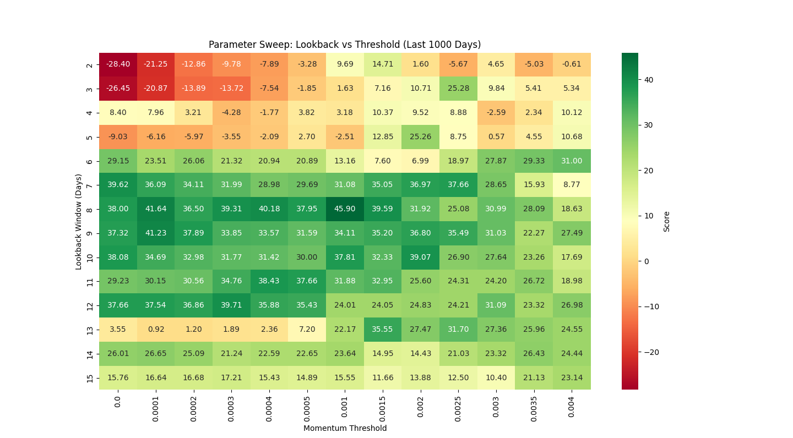

  <em>Figure 15. Lookback vs threshold sweep (last 1000 days). Green = strong score, red = poor/negative. The best region is a broad plateau around lookback ~7–10 and threshold ~0.0005–0.0015.</em>

**Key pattern:** there isn’t one fragile “needle in a haystack” optimum — there’s a **wide plateau** of good parameters.

- Very short lookbacks (≈2–5) are unstable and often negative (too noisy → churn).
- Lookbacks around **7–12** are consistently strong.
- Thresholds that are too large suppress trading (miss real trends), but **small nonzero thresholds** help filter noise and reduce commission drag.

In this sweep, the single best cell was around:

- **Lookback ≈ 8 days**
- **Threshold ≈ 0.001**

But the more important takeaway is that performance is **not** hypersensitive: neighbouring configurations remain strong, which is exactly what you want under a “robustness over optimisation” philosophy.
---

## 2.5 Results Snapshot

  

  <em>Figure 22. Cumulative PnL: Shows consistant profits over time over the entire Algothon dataset.</em>

### Interim leaderboard
- **Rank:** 5th  
- **Score:** **19.77**

### Final general round leaderboard
- **Rank:** **4th**
- **Score:** **22.26**

### Thoughts on other teams’ results (and how much was variance)

A few things stood out when looking at the leaderboard:

**1) The top of the leaderboard was tight.**  
Scores near the top were close enough that small differences in behaviour (or just a few extra good/bad days) could shuffle ranks. When the spread is small, it’s hard to claim “Team A is definitely better than Team B” just from final rank alone.

**2) The winners probably did *one* extra thing beyond a basic signal.**  
Our strategy is basically “market direction + risk control”. If someone beat that, the most likely reasons are:
- better **position sizing** (more accurate volatility targeting, better handling of outliers)
- smarter **turnover control** (fewer unnecessary flips, better use of thresholds / hysteresis)
- better **risk limits** (avoiding taking risk during messy periods, or scaling down in high-vol regimes)
- or finding a small **extra alpha source** on top (even a weak edge can matter if it doesn’t add turnover)

**3) Some high scores could definitely be “right idea, right regime”.**  
If the evaluation period happened to favour:
- clean market momentum stretches,
- low whipsaw,
- or a volatility pattern that suited a certain filter,
then strategies that lean harder into that regime will look amazing. That doesn’t mean they’ll hold up the next time.

That’s exactly why we valued walk-forward testing: it’s not perfect, but it reduces the chance that my strategy only worked because the last block happened to match it.

**4) The middle of the pack is where overfitting usually hides.**  
A lot of teams probably had strategies that:
- looked great on one backtest,
- had hidden churn,
- or were tuned too tightly to one dataset.
Those strategies can land anywhere depending on noise. If you’re relying on fragile edges, rank becomes much more about variance.

**My honest takeaway:**  
I think our final placement is a mix of:
- a real edge (market momentum was genuinely present),
- solid risk/cost handling (threshold + vol scaling),
- and some unavoidable variance (because the leaderboard is tight at the top).

If we had another iteration, the first place we’d look to improve would be **reducing whipsaw damage** (e.g., smoother entry/exit logic or regime persistence) without increasing trading frequency.

---

# 3) Learnings

This competition was honestly a good reminder that most of the work in trading research is **eliminating bad ideas**, not finding fancy ones. The dataset looks simple (daily prices), but the constraints (costs + position caps + integer shares) make a lot of “textbook” strategies fall apart fast.

---

## 3.1 Market Learnings

### In this dataset, the best signal was the simplest one
From the market analysis, most of the structure was:

- weak pairwise correlation between stocks (pairs trading basically dead)
- weak and unstable single-stock momentum
- strong **market-level** short-horizon momentum (especially 1–2 day effects)

### Mean reversion wasn’t an easy profit
We expected at least some clean bounce-back after extreme moves, but the market more often showed **follow-through** rather than snapping back. That doesn’t mean mean reversion never works, it just wasn’t dominant at the daily horizon in this universe.

### Regimes matter more than indicators
The strategy didn’t sometimes fail because momentum “stopped existing”. It mostly failed in specific periods where the market got choppy and direction flipped often. So a lot of the edge comes from:

- recognising when conditions are good for the signal
- trading less when the regime is unclear

### Turnover kills strategies
Many strategies looked decent before costs and then became useless after commission. The best improvements I made weren’t about finding new signals, they were about reducing pointless trades:

- adding a **threshold** so the bot stays flat when the market move is tiny
- avoiding rapid flip-flopping in choppy periods
- accepting that “doing nothing” is often the best trade

---

## 3.2 Process Learnings

### The fastest progress came from deleting ideas early
At the start we spent time exploring lots of different strategy styles. The turning point was getting ruthless about filtering:

- if a strategy didn’t survive costs, it was dead
- if it only worked in one small slice of time, it was suspicious
- if it needed heavy tuning, it was probably overfit

Once we started prioritising robustness over complexity, our iteration speed improved a lot.

### A small number of good plots beats spamming plots.
It’s really tempting to produce dozens of charts, but the most useful ones were the ones that directly answered a decision:

- “Is there any cross-asset structure?” (correlation matrix)
- “Is momentum real at the market level?” (market ACF / rolling ACF)
- “Does mean reversion actually show up?” (next-day scatter / bounceback extremes)
- “Is volatility mainly time-varying or stock-specific?” (vol distributions / extremes)

Everything else was mostly noise.

---

## 3.3 Biggest Mistakes

- **Over-testing fragile ideas early.**  
  We spent too long on strategies that were never going to survive the low-correlation structure and commission model.

- **Not focusing on trading cost control from day one.**  
  We initially treated costs as something to “add later”. In reality, costs decide what’s even feasible.

- **Trying to extract per-stock alpha in a market that didn’t support it.**  
  The data strongly suggested market-level structure was the main thing. I should’ve committed to that direction earlier.

---

## 3.4 What We’d Do Differently Next Time

- **Work backwards from the scoring function earlier.**  
  Since the score penalises volatility, I’d treat variance reduction and turnover reduction as first-class goals from the start.

- **Spend more time on “damage control.”**  
  Our strategy works well in clean regimes. The main weakness is chop. Next iteration We’d focus on better entry/exit smoothing (without increasing trading frequency).

- **Build a clearer “regime dashboard.”**  
  A few simple signals (volatility state, momentum strength, trend consistency) could make it easier to scale risk down when conditions are bad.

---

# 4) Conclusion

This Algothon ended up being less about inventing a fancy model and more about finding **one real edge** and making it **tradable under constraints**.

### What worked best
- Trading **market-level momentum** rather than trying to pick individual winners and losers.
- Using a **threshold** to avoid noise trading and reduce commission drag.
- Using **volatility scaling** so risk was spread more evenly across the universe.

### What didn’t work
- Cross-asset relative value ideas (pairs / cointegration), the correlation structure was simply too weak.
- Broad “fade extremes” mean reversion, the market often showed follow-through instead of snapping back.
- Anything that required frequent trading, costs quickly wiped out the edge.

### Final takeaway
In this environment, **robustness beats complexity**. The strategies that survive are the ones that:
- trade infrequently,
- size risk properly,
- and rely on structure that shows up repeatedly (not just once).

### Future work
If I were to iterate on this bot, I’d stay in the same general family (market regime + risk control) and focus on:
- better handling of choppy periods,
- more deliberate risk scaling across volatility regimes,
- and adding small, low-turnover “helper signals” (only if they improve stability without increasing churn).

---

## Repository Structure

- `main.py` - final submission bot (contains `getMyPosition`)
- `eval.py` - baseline evaluator (single run)
- `eval_full.py` - extended walk-forward + robustness tests
- `market_analyser.py` - plots to identify good strategies and eliminate weak ones
- `trade_analyser.py` - diagnostic tool to visualise the algorithm’s trades  
- `plots/` - research and diagnostics figures used in this write-up
- `images/` - team photos
