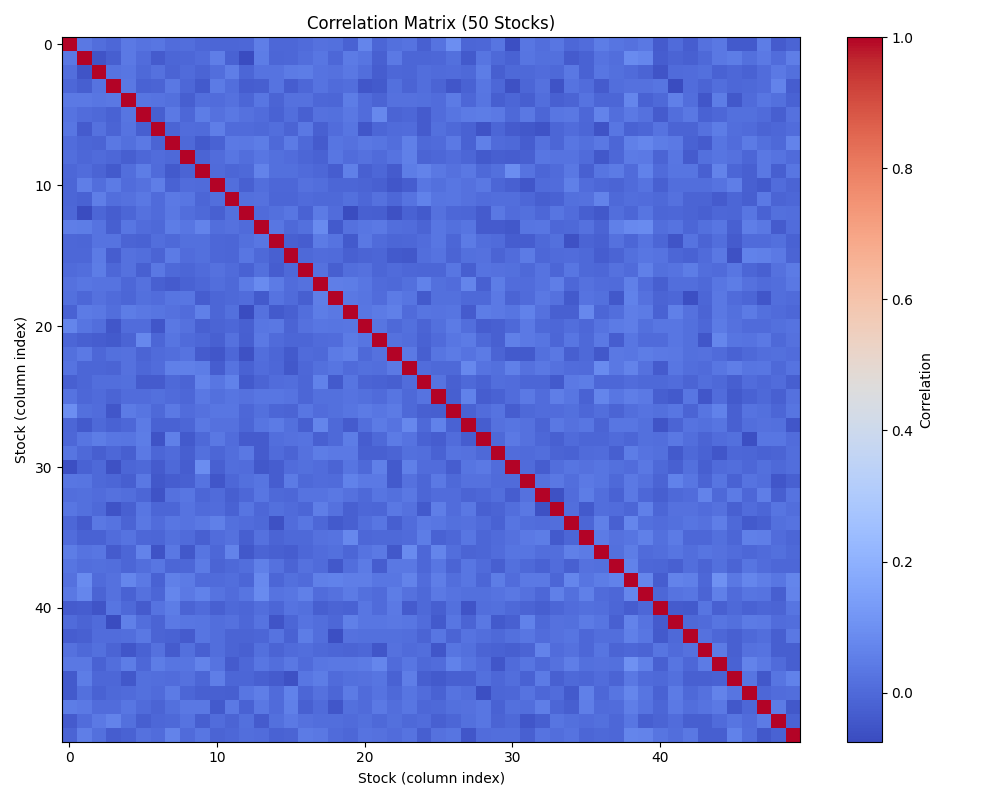
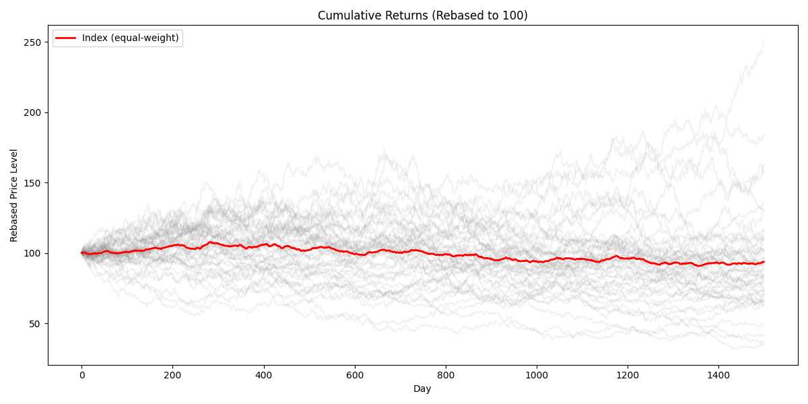
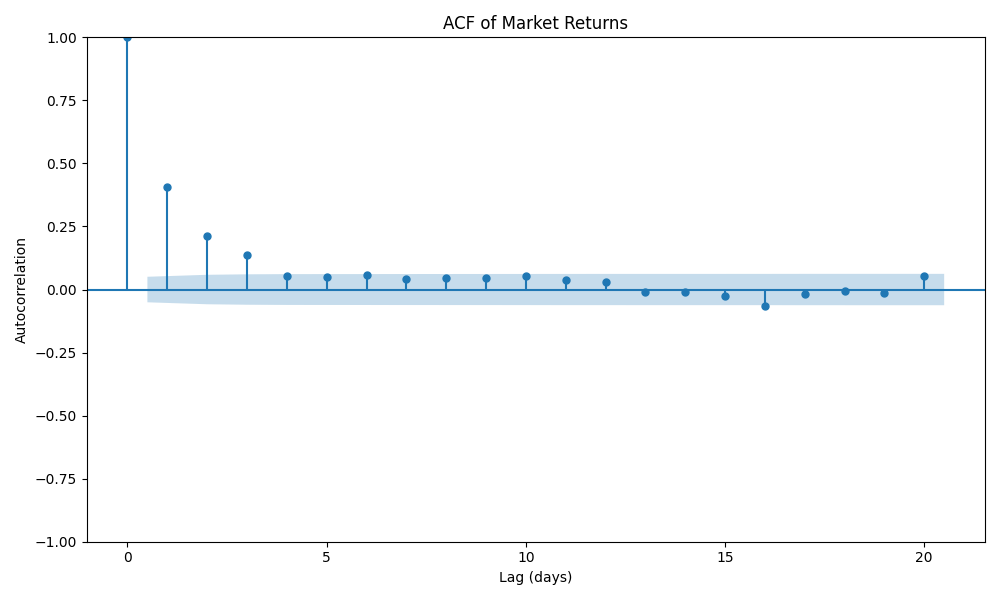

# Team RAJ 🚀  
**SIG Algothon 2025 — Strategy, Research, and Insights**

> This repository contains my research notes, analysis plots, and algorithm submission(s) for the SIG Algothon.  
> It is written both as a post-mortem and as a reference for anyone learning systematic trading or competition-style quantitative research.

---

## Introduction

Hi — I’m James, an engineering student at Monash University with a strong interest in quantitative finance.

This report documents:
- how I explored the market data,
- the hypotheses I tested,
- which strategies were viable (and which were not),
- what was implemented in the final algorithm,
- what worked / didn’t work,
- and what I learned from the process.

The emphasis throughout is on **robustness**, **risk awareness**, and **avoiding overfitting**, rather than maximizing in-sample performance.

---

## About the SIG Algothon

**SIG Algothon** is an algorithmic trading competition where participants build bots to trade instruments in a simulated market environment under realistic constraints.

---

## Environment Assumptions

- **Instruments:**  
  50 synthetic instruments in a simulated trading universe, indexed from 0 to 49.

- **Time period & frequency:**  
  Daily price data spanning several years (~1500 observations).  
  On each trading day *t*, the algorithm receives the full price history from day 0 to *t*.  
  Final evaluation is performed on unseen future data from the same universe.

- **Execution model:**  
  Market-style execution at the most recent available price.  
  Trades are executed based on the **difference** between the previous day’s position and the newly requested position.

- **Costs:**  
  Fixed commission of **5 basis points (0.0005)** applied to total dollar volume traded.  
  No explicit bid–ask spread or slippage is modelled beyond this.

- **Constraints:**  
  - Long and short positions are allowed  
  - Maximum position size of **±$10,000 per instrument** at trade time  
  - Temporary breaches due to price movements are allowed but must be corrected the following day  
  - Positions are integer numbers of shares  
  - Positions are automatically clipped by the evaluation engine if limits are exceeded

- **Objective metric:**  

  **Score = mean(P&L) − 0.1 × std(P&L)**  

  where P&L is computed over the evaluation period on unseen data.

---

# 1) Market Analysis

## 1.0 Strategy Feasibility Screening

Before developing specific trading strategies, I first assessed which approaches were compatible with the data resolution, execution model, and constraints of the competition. Several common strategy classes were evaluated and explicitly excluded or de-emphasized.

### Excluded: Market Making
Market making relies on intraday price dynamics, bid–ask spreads, and order book information.  
Given that the dataset consists solely of daily close prices with no microstructure data, market making strategies were deemed infeasible and excluded.

### Excluded: Pure Arbitrage
Classic arbitrage strategies require deterministic pricing relationships, cross-venue discrepancies, or known conversion mechanics.  
Due to the absence of intraday prices, cross-product constraints, or explicit pricing rules in the simulation, no persistent arbitrage opportunities were identified.

### De-emphasized: Machine Learning
Machine learning models were explored, but the relatively small sample size (~1500 daily observations) and low signal-to-noise ratio made reliable generalization difficult.  
In most cases, ML-based models failed to outperform simpler baselines after costs and constraints, and were therefore not used in the final strategy.

---

## 1.1 Pairs Trading — Viability Analysis

Pairs trading is a **relative-value** strategy. Instead of predicting whether the market will go up or down, it looks for two stocks that move closely together. If their prices temporarily diverge, the strategy bets that they will revert back to their usual relationship.

To assess whether this was viable, I first examined the cross-asset correlation structure.

  

  <em>Figure 1. Correlation matrix of the 50 stocks. Off-diagonal values are uniformly low, indicating weak cross-asset relationships.</em>

### What This Graph Shows

The plot above is a **correlation matrix** of the 50 stocks.

- Each square represents the correlation between a pair of stocks.
- Red along the diagonal simply shows that each stock is perfectly correlated with itself (correlation = 1).
- The off-diagonal squares represent how strongly different stocks move together.
- Darker blue colours indicate low or near-zero correlation.

In this matrix, almost all off-diagonal values are light blue. The strongest pairwise correlation is only around **0.1**, which is very low.

### Why This Matters for Pairs Trading

Pairs trading relies on finding two assets that:

1. Move closely together (high correlation), and  
2. Have a stable long-term relationship (often tested with cointegration).

If two stocks barely move together in the first place, there is no meaningful spread relationship to exploit. Small, unstable correlations suggest:

- No strong common drivers between assets.
- No persistent relative pricing relationship.
- High likelihood that any apparent relationship is just noise.

Without strong and stable co-movement, any spread constructed between two stocks would behave more like random noise than a mean-reverting signal.

### Conclusion

Because the correlation structure showed **uniformly low cross-asset correlations**, there were no clear candidate pairs worth pursuing.

Given this, I decided not to proceed with deeper analysis such as formal cointegration testing. The data did not provide a strong enough foundation to justify further research into pairs trading, so this approach was excluded from the final algorithm.

---

## 1.2 Momentum

Momentum assumes that assets with strong recent performance continue to outperform over a given horizon (and weak performers continue to lag). In this market, the key question was whether returns showed enough short-term persistence to make momentum signals meaningful, rather than pure noise.

  

  <em>Figure 2. Cumulative returns of the 50 stocks (grey) with an equal-weight “market” index in red, rebased to 100. Individual names diverge substantially over time, while the index is smoother and often drifts sideways.</em>

### Cross-sectional behaviour

Figure 2 shows that while the equal-weight index does not exhibit a strong, sustained trend over the full period, individual stocks spread out widely. This indicates meaningful dispersion in performance across names and suggests the market experiences periods where moves are directional, even if the long-run index level is relatively flat.

To test whether directional moves tend to persist, I examined the autocorrelation of daily market returns.

  

  <em>Figure 3. Autocorrelation function (ACF) of daily returns for the equal-weight market index. Lag 1 and lag 2 are strongly positive and exceed the confidence band, indicating short-horizon return persistence.</em>

### Evidence for short-horizon momentum

The ACF in Figure 3 shows clear positive autocorrelation at the first few lags, with lag 1 around 0.4 and lag 2 around 0.2 to 0.25. Both exceed the confidence band, supporting the presence of statistically meaningful short-term persistence in market returns.

In practical terms, this implies that recent market direction carries information for the next one to two trading days, which is consistent with short-horizon momentum. The effect appears concentrated in the earliest lags, so momentum signals based on recent history (days to a couple of weeks) are more justified by these diagnostics than long-horizon trend-following.

### Conclusion

Overall, the market structure suggested momentum was viable, but primarily as a short-horizon effect. Individual stocks showed large dispersion over time, and the equal-weight market returns displayed strong positive autocorrelation at early lags. This supported focusing momentum research on short lookback windows that align with where persistence was most visible.

---

## 1.3 Mean Reversion

Mean reversion assumes prices revert toward an anchor such as a rolling mean or long-term trend.

### What I tested
- z-score reversion around rolling means
- EMA-based deviation triggers
- autocorrelation of returns (with random baselines)
- reversion speed relative to transaction costs

**Key takeaway:**  
Single-asset mean reversion showed more consistent behaviour than cross-asset strategies, particularly when trades were filtered by volatility and trend conditions.

---

## 1.4 Volatility & Regimes

Volatility and correlation often define regimes in which strategies behave very differently.

### Signals explored
- rolling annualized volatility
- rolling average pairwise correlation
- long-term trend filter (price vs MA-200)
- distributional shifts (skew, kurtosis)

### How regimes were used
- scaling position sizes
- tightening or loosening thresholds
- disabling strategies during stress regimes

**Key takeaway:**  
Conditioning signals on volatility and trend regimes significantly improved stability and reduced drawdowns.

---

# 2) Algorithm Analysis

## 2.1 Final Strategy Overview

- **Core edges:**  
  Single-asset mean reversion combined with regime filters

- **Execution style:**  
  Daily market execution with full position rebalancing

- **Risk management:**  
  Position caps, volatility scaling, and regime-based exposure reduction

- **Fail-safes:**  
  Position clipping awareness, conservative defaults, and cooldown logic

---

## 2.2 Signal Construction
For each signal:
- inputs and preprocessing
- mathematical definition
- parameter choices
- intuition for why it should work in this environment

---

## 2.3 Portfolio Construction & Risk
- position sizing rules
- exposure caps
- diversification logic
- drawdown and volatility controls

---

## 2.4 Backtesting Methodology
- execution assumptions
- transaction cost modelling
- walk-forward validation
- known sources of bias and mitigation

---

## 2.5 Parameter Selection & Robustness
- grid search ranges
- stability regions versus sharp optima
- ablation tests removing individual components

---

## 2.6 Results Snapshot
- leaderboard score / rank (if shareable)
- cumulative P&L curves
- drawdowns and volatility
- periods of strongest and weakest performance

---

# 3) Learnings

### Technical
- data handling and backtesting pitfalls
- cost sensitivity and turnover control

### Quant intuition
- where signal genuinely exists versus noise
- importance of regime awareness

### Process
- faster elimination of weak ideas
- earlier focus on robustness

**Biggest mistakes**
- <mistake 1>
- <mistake 2>

**What I’d do differently**
- <improvement 1>
- <improvement 2>

---

# 4) Conclusion

- **What worked best:**  
  Regime-filtered single-asset signals

- **What didn’t work:**  
  Cross-asset relative-value strategies in a low-correlation universe

- **Final takeaways:**  
  Robustness beats complexity; elimination is as important as discovery

- **Future work:**  
  Explore richer regime definitions and alternative anchoring mechanisms

---

## Repository Structure
<describe folders and files>
